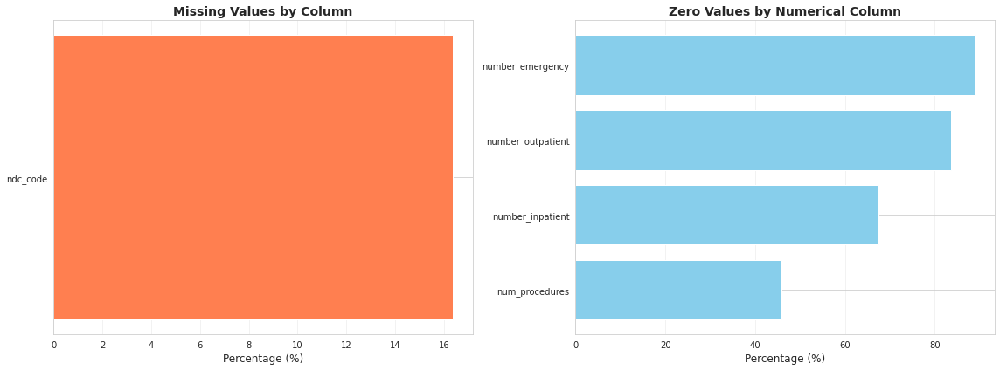
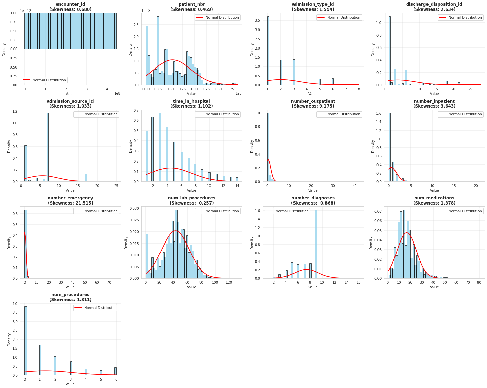
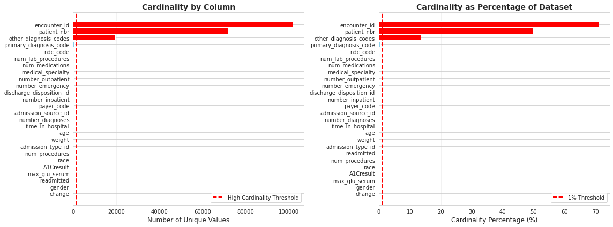
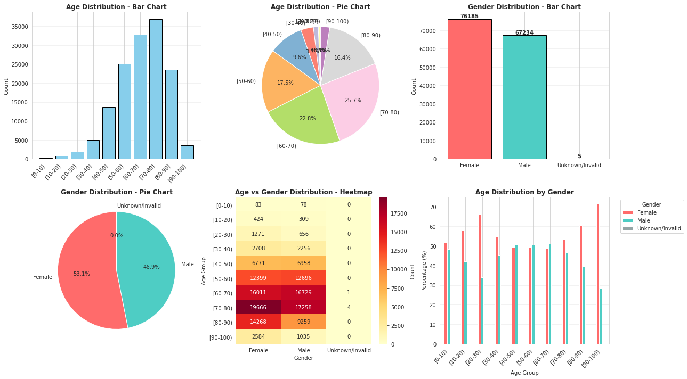
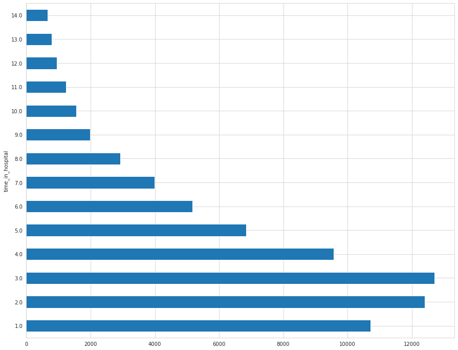
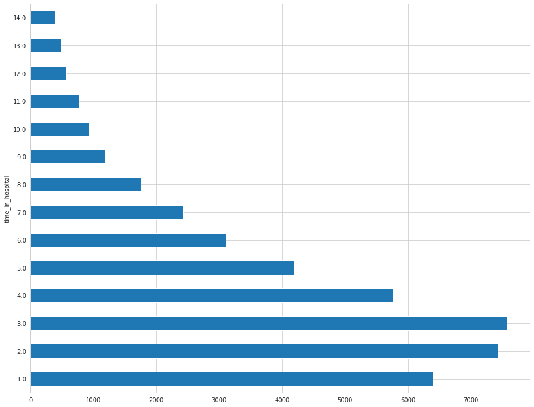
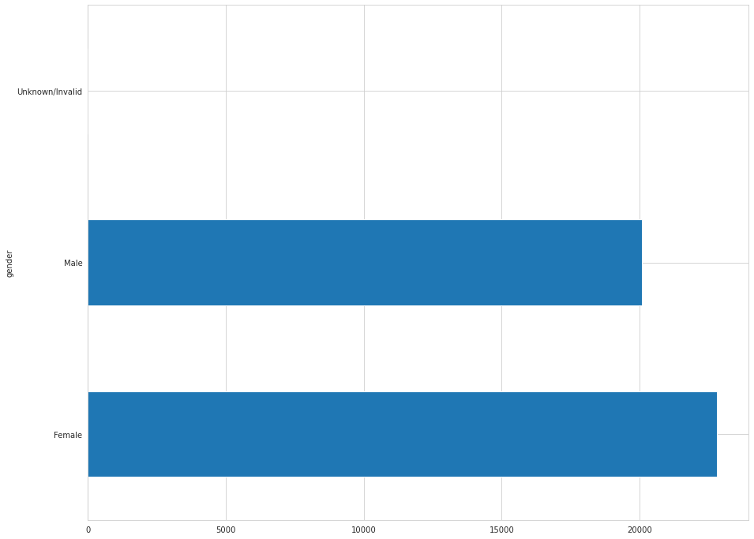
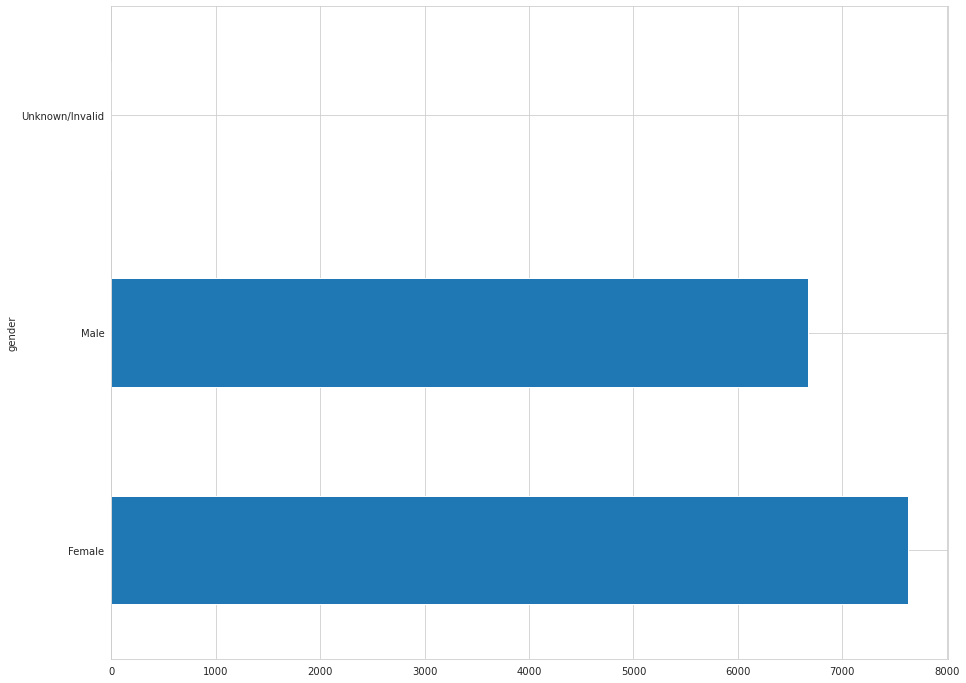
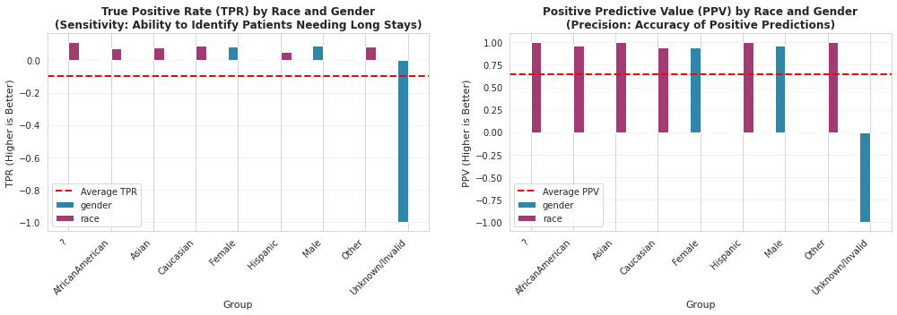
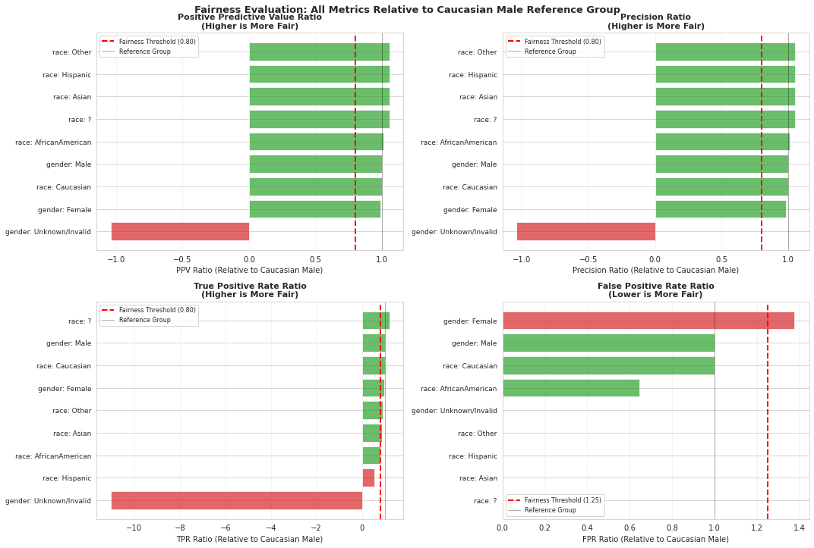

# Diabetes Drug Testing
**Context**: You are a data scientist for an exciting unicorn healthcare startup that has created a groundbreaking diabetes drug that is ready for Phase III clinical trial testing. It is a very unique and sensitive drug that requires administering and screening the drug over at least 5-7 days of time in the hospital with frequent monitoring/testing and patient medication adherence training with a mobile application. You have been provided a patient dataset from a client partner and are tasked with building a predictive model that can identify which type of patients the company should focus their efforts testing this drug on. Target patients are people that are likely to be in the hospital for this duration of time and will not incur significant additional costs for administering this drug to the patient and monitoring.  

In order to achieve your goal you must build a regression model that can predict the estimated hospitalization time for a patient and use this to select/filter patients for your study.

**Expected Hospitalization Time Regression Model:** Utilizing a synthetic dataset(denormalized at the line level augmentation) built off of the UCI Diabetes readmission dataset, students will build a regression model that predicts the expected days of hospitalization time and then convert this to a binary prediction of whether to include or exclude that patient from the clinical trial.

This project will demonstrate the importance of building the right data representation at the encounter level, with appropriate filtering and preprocessing/feature engineering of key medical code sets. This project will also require students to analyze and interpret their model for biases across key demographic groups. 

### Dataset
Due to healthcare PHI regulations (HIPAA, HITECH), there are limited number of publicly available datasets and some datasets require training and approval. So, for the purpose of this exercise, we are using a dataset from UC Irvine that has been modified for this course. Please note that it is limited in its representation of some key features such as diagnosis codes which are usually an unordered list in 835s/837s (the HL7 standard interchange formats used for claims and remits).

- https://archive.ics.uci.edu/ml/datasets/Diabetes+130-US+hospitals+for+years+1999-2008

## Getting Started

Follow the instructions in `starter_code/student_project.ipynb` and be sure to set up your Anaconda environment to get started!

### Dependencies
Using Anaconda consists of the following:

1. Install [`miniconda`](http://conda.pydata.org/miniconda.html) on your computer, by selecting the latest Python version for your operating system. If you already have `conda` or `miniconda` installed, you should be able to skip this step and move on to step 2.
2. Create and activate * a new `conda` [environment](http://conda.pydata.org/docs/using/envs.html).

\* Each time you wish to work on any exercises, activate your `conda` environment!

---

## 1. Installation

**Download** the latest version of `miniconda` that matches your system.

|        | Linux | Mac | Windows | 
|--------|-------|-----|---------|
| 64-bit | [64-bit (bash installer)][lin64] | [64-bit (bash installer)][mac64] | [64-bit (exe installer)][win64]
| 32-bit | [32-bit (bash installer)][lin32] |  | [32-bit (exe installer)][win32]

[win64]: https://repo.continuum.io/miniconda/Miniconda3-latest-Windows-x86_64.exe
[win32]: https://repo.continuum.io/miniconda/Miniconda3-latest-Windows-x86.exe
[mac64]: https://repo.continuum.io/miniconda/Miniconda3-latest-MacOSX-x86_64.sh
[lin64]: https://repo.continuum.io/miniconda/Miniconda3-latest-Linux-x86_64.sh
[lin32]: https://repo.continuum.io/miniconda/Miniconda3-latest-Linux-x86.sh

**Install** [miniconda](http://conda.pydata.org/miniconda.html) on your machine. Detailed instructions:

- **Linux:** http://conda.pydata.org/docs/install/quick.html#linux-miniconda-install
- **Mac:** http://conda.pydata.org/docs/install/quick.html#os-x-miniconda-install
- **Windows:** http://conda.pydata.org/docs/install/quick.html#windows-miniconda-install

## 2. Create and Activate the Environment

For Windows users, these following commands need to be executed from the **Anaconda prompt** as opposed to a Windows terminal window. For Mac, a normal terminal window will work. 

#### Git and version control
These instructions also assume you have `git` installed for working with Github from a terminal window, but if you do not, you can download that first with the command:
```
conda install git
```

If you'd like to learn more about version control and using `git` from the command line, take a look at our [free course: Version Control with Git](https://www.udacity.com/course/version-control-with-git--ud123).

**Now, we're ready to create our local environment!**

1. Clone the repository, and navigate to the downloaded folder. This may take a minute or two to clone due to the included image data.
```
git clone https://github.com/udacity/nd320-c1-emr-data-starter.git
cd nd320-c1-emr-data-starter/project/
```

2. Create (and activate) a new environment, named `udacity-ehr-env` with Python 3.7. If prompted to proceed with the install `(Proceed [y]/n)` type y.

	- __Linux__ or __Mac__: 
	```
	conda create -n udacity-ehr-env python=3.7
	source activate udacity-ehr-env
	```
	- __Windows__: 
	```
	conda create --name udacity-ehr-env python=3.7
	activate udacity-ehr-env
	```
	
	At this point your command line should look something like: `(udacity-ehr-env) <User>:USER_DIR <user>$`. The `(udacity-ehr-env)` indicates that your environment has been activated, and you can proceed with further package installations.


6. Install a few required pip packages, which are specified in the requirements text file. Be sure to run the command from the project root directory since the requirements.txt file is there. I also added a line for installing the environment in your notebook in case this is new for you. You should be able to now look for the environment when you select the kernel.
 
```
pip install -r requirements.txt
ipython3 kernel install --name udacity-ehr-env --user

```

## Exploratory Data Analysis (EDA)

This section shows the full analysis workflow from `starter_code/student_project.ipynb`.

### Missing and Zero Values

The missing-values panel shows that `ndc_code` is the only field with notable missingness (about 16%), while the rest of the displayed variables are effectively complete. In contrast, the zero-values panel indicates strong zero inflation in utilization/count features: `number_emergency` is near 89% zeros, `number_outpatient` is near 84% zeros, `number_inpatient` is near 67% zeros, and `num_procedures` is near 45% zeros. This pattern suggests the dataset represents many patients with no prior acute utilization events, which is clinically plausible, but it also implies highly right-skewed predictors with limited variance in the non-zero region. Practically, this means model performance will depend on handling sparsity correctly (for example, preserving zero as informative state, considering count-aware transformations, and avoiding naive assumptions of normality).



## Distribution and Gaussian Analysis

The Gaussian diagnostic shows that most numerical features are non-normal and right-skewed, with the strongest departures in utilization variables: `number_emergency` (skewness about 21.5), `number_outpatient` (about 9.2), and `number_inpatient` (about 3.6), each with heavy mass near zero and long right tails. Administrative fields are also right-skewed (`admission_type_id` about 1.6, `discharge_disposition_id` about 2.6, `admission_source_id` about 1.0), and the target `time_in_hospital` itself is moderately right-skewed (about 1.1), indicating more short stays than long stays. Among displayed features, `num_lab_procedures` (about -0.26) is closest to symmetric/near-Gaussian behavior, while `number_diagnoses` (about -0.87) shows mild left skew with discrete concentration. `num_medications` (about 1.38) and `num_procedures` (about 1.31) remain right-skewed but less extreme than prior-visit counts. Overall, the red normal overlays fit poorly for most variables, such that the plot supports using preprocessing and model choices robust to skewed, zero-inflated, and discrete count-like inputs rather than assuming Gaussian predictors.  



## High Cardinality Analysis

The high-cardinality plot shows a sharp concentration of uniqueness in a small set of fields. `encounter_id` is the most dominant field with about 102k unique values (around 71% of rows), followed by `patient_nbr` with about 71k unique values (around 50%). `other_diagnosis_codes` is also clearly high-cardinality at roughly 18k–19k unique values (about 13%–14%). In contrast, most remaining variables sit near the origin on both charts and fall below the 1% threshold, indicating low-to-moderate cardinality relative to dataset size. This structure separates identifier-like columns from model signal columns: `encounter_id` and `patient_nbr` should be treated as keys (not predictive features), while high-cardinality clinical text/code fields require controlled encoding or grouping to avoid sparse feature explosion and overfitting.



## Demographic Distributions

The demographic panel shows a strongly older cohort, with the largest age bucket at 70-80 years (36,928 patients, about 25.7%), followed by 60-70 (32,741, about 22.8%), 50-60 (25,095, about 17.5%), and 80-90 (23,527, about 16.4%). Combined, ages 50-90 account for roughly 82.5% of the population, confirming that the study population is concentrated in late-middle and older adulthood, which is consistent with diabetes hospitalization patterns. Gender composition is relatively balanced but not equal: Female 76,185 (53.1%), Male 67,234 (46.9%), and Unknown/Invalid only 5 records (about 0.0%). The age-by-gender heatmap indicates that both major genders peak in the 70-80 range (Female 19,666; Male 17,258), with a notable female-heavy difference at 80-90 (14,268 vs 9,259) and male-heavy differences in 50-70 (for example, 16,729 vs 16,011 in 60-70). Overall, the figure suggests low risk from missing gender values but highlights age concentration and subgroup distribution differences that should be monitored during fairness evaluation and split validation.



## NDC Dimensionality Reduction

Raw `ndc_code` values are highly granular because multiple package-level codes can represent the same underlying medication, which creates unnecessary sparsity and weakens model generalization when used directly as features. To address this, we maps each `ndc_code` to a normalized `generic_drug_name` using the lookup table, then verifies dimensionality reduction with the assertion that unique NDC codes exceed unique generic drug names. This transformation keeps clinically meaningful medication signal while collapsing redundant code variants, improving feature stability and reducing the risk of overfitting from high-cardinality medication identifiers. The practical effect is a cleaner medication representation for downstream aggregation and modeling, where the model learns therapeutic patterns rather than package-level coding noise.

## First Encounter Selection and Aggregation

This stage enforces the analytical unit required for valid supervised learning: one independent baseline encounter per patient. We implements this by ordering records on `encounter_id` and retaining the first observation for each `patient_nbr`. The resulting equality of 71,518 unique patients and 71,518 unique encounters confirms a one-to-one mapping and indicates that repeated longitudinal records were removed before model construction. Methodologically, this reduces temporal leakage risk, because information from later encounters is excluded from feature generation for earlier decision points.

After cohort restriction, the pipeline performs encounter-level aggregation of medication lines by collapsing repeated `generic_drug_name` entries into a single feature representation (array-to-dummy expansion) while preserving non-medication clinical covariates. The structural check 
```
len(agg_drug_df) == agg_drug_df['patient_nbr'].nunique() == agg_drug_df['encounter_id'].nunique()
```

 verifies that aggregation is lossless with respect to encounter identity and does not create duplicate analytical rows. This transformation converts denormalized claim-like rows into a stable encounter matrix, improving feature consistency, preserving patient-level independence for partitioning, and producing a defensible input table for downstream performance and fairness evaluation.

## Feature Selection Rationale

Feature inclusion and exclusion were guided by completeness, clinical relevance, and information quality constraints. Demographic covariates (`race`, `gender`, `age`) are retained because they are essential for fairness auditing and are fully observed. Clinical context features (`admission_type_id`, `discharge_disposition_id`, `admission_source_id`, `medical_specialty`) were included as they capture hospital logistics and routing patterns associated with stay duration. Laboratory and clinical indicators (`max_glu_serum`, `A1Cresult`, `change`, `readmitted`) provide direct signals of metabolic state and disease trajectory.

Two fields were explicitly excluded based on missingness and reliability criteria. **`payer_code`** was rejected because EDA showed >60% missing or unknown values ('?'), which introduces severe sparsity and cardinality concerns; including such incomplete, high-cardinality features increases bias risk and undermines model stability without providing sufficient signal. **`weight`** was excluded for two reasons: (1) the column contains missing values inconsistent with systematic measurement, and (2) more direct clinical indicators of health status are available (e.g., `number_diagnoses`, `num_procedures`, `A1Cresult`), making imputation of weight an unnecessary engineering cost that could introduce artificial signal rather than recover true patterns.

Utilization features (`number_outpatient`, `number_inpatient`, `number_emergency`, `num_lab_procedures`, `number_diagnoses`, `num_medications`, `num_procedures`) capture prior healthcare engagement and acuity signals. Finally, medication features are represented as one-hot-encoded binary indicators derived from the normalized generic drug names produced by NDC dimensionality reduction, preserving therapeutic information in a feature-stable representation. This selective approach prioritizes data quality and clinical signal over exhaustive feature inclusion, supporting both predictive performance and interpretability.

## Train/Validation/Test Split Checks

#### Label Distribution Across Partitions

The split validation compares `time_in_hospital` distributions for the full dataset, training partition, and test partition. The expected pattern is right-skewed in all three views, with high concentration at shorter stays and a progressively thinner tail at longer stays. When these histograms retain similar peak location, tail decay, and overall shape, the split is distributionally stable and model evaluation remains interpretable. If train and test diverge materially, observed performance can reflect partition shift rather than true model generalization. The histogram check therefore acts as a structural diagnostic that the patient-level 60/20/20 split preserved target behavior across partitions.

**Full Dataset (reference distribution):** This histogram defines the baseline target behavior for `time_in_hospital`. The distribution is right-skewed, with the highest density at shorter stays and a long decreasing tail at higher day counts. This indicates the cohort is dominated by short admissions, while long-stay cases are less frequent but still present and clinically important.



**Train Partition (fit distribution):** This plot is used to confirm that model training data preserves the same target structure as the full cohort. The train histogram should keep a similar peak region, skew direction, and tail pattern. When this alignment holds, the model is fit on representative label dynamics rather than a shifted subset.



**Test Partition (evaluation distribution):** This histogram validates that the evaluation set is sampled from the same target process as the full and training partitions. If the test shape remains comparable in center and tail behavior, downstream metrics primarily reflect model generalization. If it diverges, performance can be distorted by partition drift rather than true predictive quality.


#### Demographic Distribution Across Partitions

The demographic split check verifies that the patient-level 60/20/20 partition preserved gender composition across the full dataset, training partition, and test partition. Because the split is performed at the patient level, each patient's demographic profile appears in exactly one partition. The analysis groups patients by `patient_nbr` (retaining one record per patient) and then visualizes `gender` distribution using `show_group_stats_viz`. When the gender proportions across all three views remain closely aligned, the split is demographically stable and any observed fairness gaps in model output can be attributed to model behavior rather than input data imbalance introduced by the partition. Material divergence in gender share — for example, if Female proportion in train differs substantially from test — would indicate that the split injected demographic skew that confounds downstream fairness evaluation.

**Full Dataset (reference demographic distribution):** This bar chart establishes the baseline gender composition for the full patient cohort after deduplication to first encounter. The cohort is approximately Female-majority (~53%) and Male-minority (~47%), with a negligible Unknown/Invalid category. This distribution defines the demographic ground truth that both training and test partitions should reflect. Because this view is patient-deduplicated, it captures each individual once and removes repeat-encounter inflation, making it the appropriate demographic reference for a patient-level split.


**Train Partition (fit demographic distribution):** This chart confirms that the training data preserves the same gender proportions as the full cohort. The training set is the largest partition (approximately 60% of patients) and is used to fit all model parameters, including any parameters sensitive to demographic representation. If gender shares in this partition closely match those in the full dataset, the model is trained on a representative demographic sample. Significant deviation here would bias learned associations in a direction not reflective of the broader patient population.



**Test Partition (evaluation demographic distribution):** This chart validates that the evaluation cohort carries the same gender structure as both the full dataset and the training partition. Consistent proportions across full, train, and test indicate that performance estimates and fairness metrics computed on the test set reflect the model's behavior on a representative sample rather than a demographically shifted subset. If this partition's gender distribution were skewed relative to the reference, observed fairness disparities could arise from partition imbalance rather than true model bias, making the fairness audit unreliable.



## Modeling and Uncertainty

The predictive model is implemented with TensorFlow Probability to generate a full probabilistic output for each patient rather than only a single point estimate. The network uses `tfp.layers.DenseVariational` followed by `tfp.layers.DistributionLambda`, which parameterizes a Normal distribution for predicted `time_in_hospital`. From that distribution object, the pipeline extracts `loc` and `scale` through `get_mean_std_from_preds`, stored as `pred_mean` and `pred_std` in `prob_output_df`. This allows each prediction to be interpreted as an estimated stay duration with quantified uncertainty instead of a deterministic value.

Operationally, uncertainty can be interpreted as a prediction range around the mean, where larger `pred_std` indicates lower confidence and smaller `pred_std` indicates higher confidence. A practical approximation is a 95% interval using `pred_mean +/- 1.96 * pred_std`, which can support clinical triage and review prioritization: high-uncertainty cases can be flagged for additional human assessment, while low-uncertainty cases support more stable automated screening. This uncertainty-aware framing improves risk communication and makes downstream selection decisions more defensible than relying on point predictions alone.

## Binary Conversion for Patient Selection

To operationalize trial eligibility, the continuous regression output is converted into a binary decision rule aligned with the clinical screening objective. The conversion is applied to the probabilistic mean estimate (`pred_mean`) from `prob_output_df`, not the raw sampled prediction. The helper function `get_student_binary_prediction` maps each case to class 1 when `pred_mean >= 5` and class 0 otherwise, where class 1 represents patients likely to require at least 5 hospital days and therefore meet the practical intervention window for Phase III drug administration and monitoring.

The same threshold is applied to observed outcomes to create ground-truth labels (`label_value = 1 if time_in_hospital >= 5 else 0`), ensuring prediction and truth are defined under a consistent clinical criterion. This binarization converts the regression task into an action-oriented inclusion/exclusion framework that supports downstream ROC/F1 evaluation and fairness auditing (Aequitas fields `score` and `label_value`). Methodologically, this step bridges model estimation and deployment logic: the model can still learn continuous stay duration, while final patient-selection decisions remain interpretable, threshold-based, and operationally consistent.

## Classification Performance Report

Model evaluation is performed on the binary patient-selection labels (`score` vs `label_value`) derived from the 5-day threshold. The notebook reports ROC AUC = 0.5434 and weighted F1 = 0.5579, indicating weak-to-moderate discrimination overall and an imbalanced precision-recall profile across classes. The class-level report shows strong performance for the `< 5 days` group (precision 0.6520, recall 0.9975, F1 0.79; support 9,028), but a severe detection gap for the `>= 5 days` target group (precision 0.9534, recall 0.0893, F1 0.16; support 5,277).

#### Model Performance Report Table

| Metric | Value |
| --- | --- |
| ROC AUC | 0.5434 |
| Weighted F1 | 0.5579 |
| Accuracy | 0.66 |
| Macro Avg Precision | 0.80 |
| Macro Avg Recall | 0.54 |
| Macro Avg F1 | 0.48 |
| Weighted Avg Precision | 0.76 |
| Weighted Avg Recall | 0.66 |
| Weighted Avg F1 | 0.56 |

| Class Label | Precision | Recall | F1-Score | Support |
| --- | --- | --- | --- | --- |
| < 5 days | 0.65 | 1.00 | 0.79 | 9,028 |
| >= 5 days | 0.95 | 0.09 | 0.16 | 5,277 |

This pattern means the model is conservative in assigning positive trial-eligibility labels: when it predicts a patient will stay at least 5 days, it is usually correct (high precision), but it identifies only a small fraction of truly eligible patients (very low recall). Operationally, this reduces false positives and unnecessary resource allocation, but substantially increases false negatives, which risks excluding many clinically appropriate candidates from Phase III screening. Therefore, the current operating point favors precision over sensitivity for the positive class and should be treated as a baseline requiring threshold optimization, class-weighting, and calibration work before deployment-oriented patient selection.

## Bias and Fairness Analysis (Aequitas)

#### Group Performance by Attribute

The plot shows two side-by-side grouped bar charts — True Positive Rate (TPR) on the left and Positive Predictive Value (PPV) on the right — broken down by race and gender using bars colored rose (race) and blue (gender). Each chart includes a red dashed horizontal line marking the average metric value across all groups. Bars are sorted in ascending order such that the most disadvantaged group appears at the bottom.

**TPR (True Positive Rate / Sensitivity)**  
TPR answers: *of all patients who truly need long hospital stays (≥ 5 days), what fraction does the model correctly identify?* A group with low TPR is systematically missed — the model fails to flag eligible patients in that group, which is especially dangerous in a clinical trial screening context where missed patients cannot receive a potentially beneficial intervention.

Observed TPR values by race:

| Race Group | TPR |
| --- | --- |
| Hispanic | 0.0515 ← lowest |
| African American | 0.0765 |
| Asian | 0.0800 |
| Other | 0.0854 |
| Caucasian | 0.0927 |
| ? (Unknown) | 0.1111 ← highest |

Disparity ratio (lowest / highest): **0.46** — well below the 4/5 rule threshold of 0.80, indicating significant racial disparity. Hispanic patients are identified at less than half the rate of the best-served group.

Observed TPR values by gender:

| Gender | TPR |
| --- | --- |
| Female | 0.0882 |
| Male | 0.0905 |

Gender disparity is small (~2.5 percentage points), suggesting the model is broadly gender-neutral on sensitivity.

**PPV (Positive Predictive Value / Precision)**  
PPV answers: *of all patients the model flags as trial-eligible, what fraction actually qualify?* Low PPV for a group means the model generates many false positives for that group, wasting clinical resources.

Observed PPV values by race:

| Race Group | PPV |
| --- | --- |
| Caucasian | 0.9487 ← lowest |
| African American | 0.9605 |
| Asian | 1.0000 |
| Hispanic | 1.0000 |
| Other | 1.0000 |
| ? (Unknown) | 1.0000 |

PPV disparity ratio: **0.95** — within the acceptable range (> 0.80). Across all racial groups, when the model does make a positive prediction, it is highly reliable. The model is conservative, not reckless, in its positive calls across races.

Observed PPV values by gender:

| Gender | PPV |
| --- | --- |
| Female | 0.9472 |
| Male | 0.9607 |

PPV disparity is minimal (~1.4 percentage points) and within acceptable bounds.

**Key Interpretation**  
All TPR values are extremely low overall (roughly 5–11%), consistent with the classification report showing recall of only 8.9% for the ≥ 5 days class. This means the model is overwhelmingly conservative: it almost never predicts a long stay, any group-level TPR disparity reflects an already-floor-level sensitivity being distributed unevenly. The fact that Hispanic patients sit at 0.0515 versus Caucasian at 0.0927 represents a nearly 2× gap in positive identification rates, which under the 4/5 rule qualifies as a significant disparity. For Phase III trial recruitment, this means Hispanic patients are systematically under-screened relative to Caucasian patients — a meaningful equity concern. PPV is uniformly high and differences across groups are negligible, such that the model's precision is consistent; its core problem is recall, not precision, and racial disparity concentrates in the recall dimension.



## Fairness Relative to Reference Group



This figure compares each subgroup against a fixed reference group, **Caucasian Male** (ratio = 1.0), and visualizes four fairness ratios in a 2x2 layout:

- **PPV Ratio panel**: Ratios >= 0.80 indicate acceptable parity in positive prediction reliability.
- **Precision Ratio panel**: Same interpretation as PPV (precision and PPV are equivalent here).
- **TPR Ratio panel**: Ratios >= 0.80 indicate comparable sensitivity to identify truly eligible long-stay patients.
- **FPR Ratio panel**: Ratios <= 1.25 indicate acceptable false-positive burden; values above 1.25 indicate over-flagging risk.

Threshold logic for flagging unfairness:
- **Potential unfair disadvantage** when ratio < 0.80 (for PPV/Precision/TPR)
- **Potential over-flagging** when FPR ratio > 1.25

Observed findings from the output:
- **Race disparities**:
	- Hispanic group has **TPR ratio = 0.5563** (unfair): substantially lower sensitivity than the reference group, indicating under-identification of truly eligible patients.
	- AfricanAmerican (**0.8258**) and Asian (**0.8634**) TPR ratios are above the 0.80 threshold, so they are flagged as acceptable by this rule.
- **Gender disparities**:
	- Female group has **FPR ratio = 1.3784** (unfair): more false positives than the reference group, indicating possible over-flagging.
	- Male group is the reference parity baseline (all ratios at 1.0).
- **Unknown/Invalid gender** appears as unfair on some ratios due to unstable/invalid values (for example negative ratios from sparse data handling), so this category should be interpreted with caution rather than as a robust population-level signal.

Overall fairness conclusion from this plot:
- The model does **not** show uniform bias across all dimensions, but it exhibits **targeted disparity** in specific places: under-identification for Hispanic patients (TPR) and over-flagging for Female patients (FPR).
- The notebook summarizes this as **minor disparity overall**: 5 unfair metrics out of 36 (~13.9%). In practice, these are still clinically meaningful because they affect who gets selected versus missed for trial eligibility screening.

## End-to-End Decision Logic

The workflow follows this chain of thoughts:
1. Validate data quality and distributions.
2. Reduce high-cardinality medication representation.
3. Prevent leakage with first-encounter patient-level data.
4. Select clinically relevant and reliable features.
5. Verify representative splits by label and demographics.
6. Train probabilistic model and extract uncertainty.
7. Convert to operational binary selection threshold (>= 5 days).
8. Evaluate classification tradeoffs.
9. Audit group fairness before deployment decisions.

### Reproducibility Note

To reproduce all visualizations and analysis outputs, run all cells in:
- `starter_code/student_project.ipynb`


## License

This project is licensed under the MIT License - see the [LICENSE.md]()
